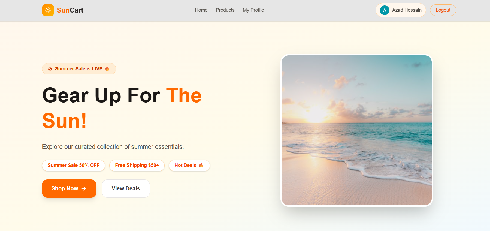

<div align="center">

# ☀️ SunCart — Summer Essentials Store

**A modern summer eCommerce platform for seasonal products like sunglasses, summer outfits, skincare, and beach accessories.**

[](https://easy-shop-project-using-next-js.vercel.app)

</div>

---

## 📖 Project Purpose

SunCart is a modern summer eCommerce platform where users can explore and purchase seasonal products like sunglasses, summer outfits, skincare, beach accessories, and more.

## 🔗 Live URL

**[easy-shop-project-using-next-js.vercel.app](https://easy-shop-project-using-next-js.vercel.app)**

## 🖼️ Screenshot




## ✨ Key Features

- 🛍️ Browse summer products with category display
- 🔐 User authentication (Email/Password + Google OAuth)
- 🔒 Protected routes — product details & profile require login
- 👤 My Profile page — view account information
- ✏️ Update Profile — change name and photo
- 📱 Fully responsive — mobile, tablet, desktop
- 🎨 Unique summer-themed UI design
- 🔔 Toast notifications for user feedback

## 🛠️ Technologies Used


## 📦 NPM Packages Used

| Package | Purpose |
|---|---|
| next | React framework with App Router |
| react | UI library |
| better-auth | Authentication (email + Google OAuth) |
| tailwindcss | Utility-first CSS styling |
| daisyui | UI component library |
| animate.css | CSS animation library |
| react-hot-toast | Toast notification library |
| lucide-react | Icon library |
| better-sqlite3 | SQLite database for auth |

## 🚀 Getting Started (Run Locally)

```bash
# 1. Clone the repository
git clone https://github.com/Azadhossain288/easy-shop-project-using-next-js.git

# 2. Move into the project folder
cd easy-shop-project-using-next-js

# 3. Install dependencies
npm install

# 4. Create a .env.local file with the required environment variables
# (Better Auth config, Google OAuth client ID/secret, etc.)

# 5. Run the development server
npm run dev
```

The app should now be running on `http://localhost:3000`.

## 🔗 Links

- 🌐 **Live Site:** https://easy-shop-project-using-next-js.vercel.app
- 💻 **Repository:** https://github.com/Azadhossain288/EasyShop-Project-Using-Next-JS

## 👤 Author

**Azad Hossain**
[LinkedIn](https://www.linkedin.com/in/azad-gazi-794180421/) • [GitHub](https://github.com/Azadhossain288) • azadhossain016288@gmail.com
